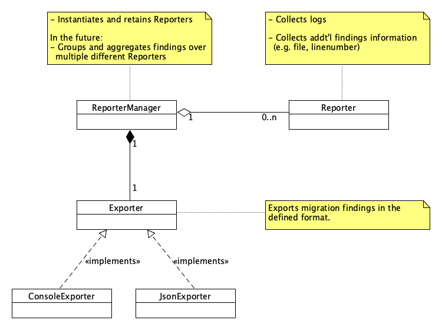

- Start Date: 2019-07-18
- RFC PR: [#42](https://github.com/SAP/ui5-migration/pull/42) 
- Issue: [#39](https://github.com/SAP/ui5-migration/issues/39)

# RFC 0001 Configurable console output

## Summary
The log output should be configurable to support use cases like machine-readability, summaries, eslint-like output.

## Motivation
The idea is to support integration scenarios where the output needs to be concise to minimize the time to identify/fix the problem.

## Detailed design

### Refactoring
In order to achieve and easy configuration and extension of the output requires a refactoring of the existing Reporter mechanism and its surrounding classes.

#### Favor composition over inheritance
The concept of Reporter being an interface, `BaseReporter` the abstract implementation and `JSONReporter`, `ConsoleReporter` and `MetaConsoleReporter` their implementation is a pretty rigid construction.
The approach should be flexible and use composition instead of inheritance.

#### Single Responsibility Principle (SRP)
The current concept makes the Reporters (`JSONReporter`, `ConsoleReporter` and `MetaConsoleReporter`) do many things:
* collect Findings
* format output
* manage other reporters
* instantiate other reporters

#### Solution

##### `Dumper`
* `Dumper` is an interface
A `Dumper` dumps given content.
It dumps findings in the given format

##### `Console`Dumper``
* Implementation of `Dumper`
Dumps content to the console

##### `JSON`Dumper``
* Implementation of `Dumper`
Dumps content in the JSON format

##### `SimpleStructure`Dumper``
* Implementation of `Dumper`
Dumps content grouped by files (like eslint) to console

##### `ReporterManager`
* Singleton
The ReportManager is able to instantiate new Reporters.
It manages them and uses them to get all findings.
It uses then a `Dumper` to dump them.

##### `Reporter`
A Reporter collects findings and logs

### Configuration
There should be a configuration option such that the user can configure the way the output is reported with option `--dump`.

## How we teach this
- Documentation
- Blog article

## Drawbacks

## Alternatives

## Unresolved Questions and Bikeshedding
